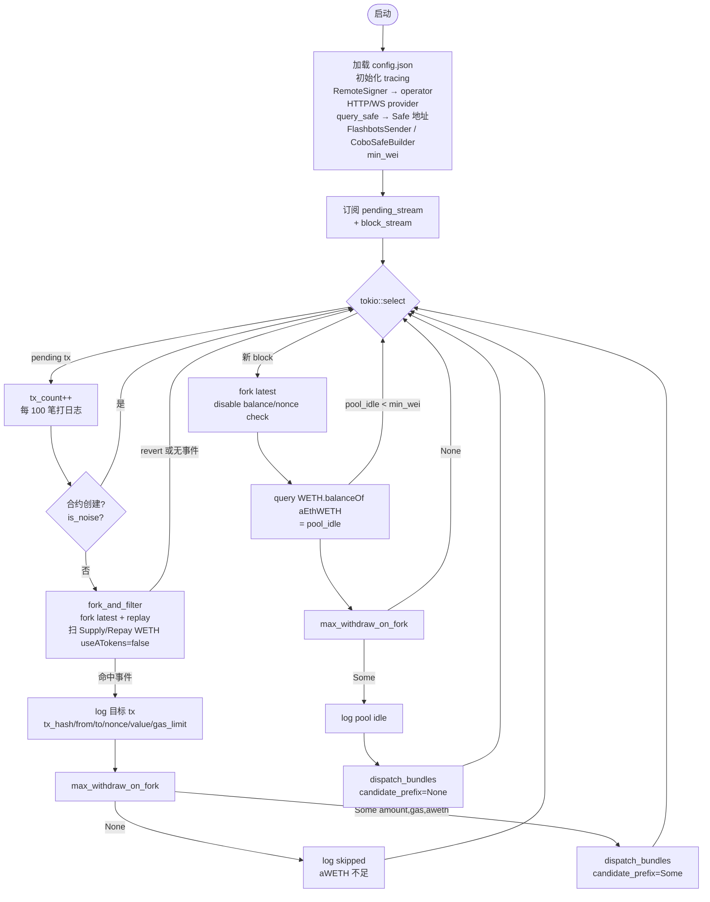
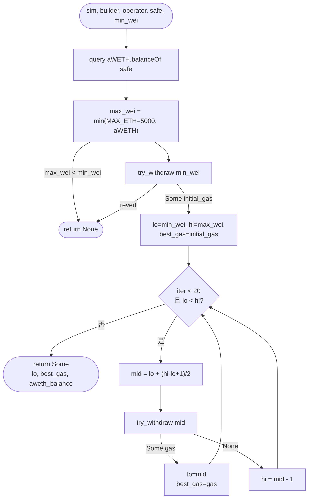
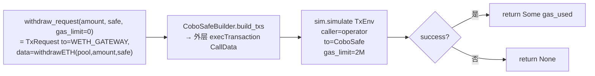
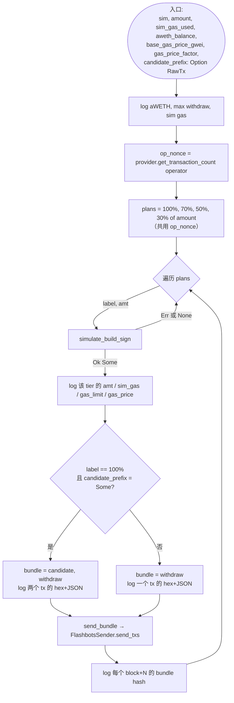
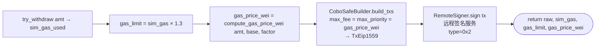
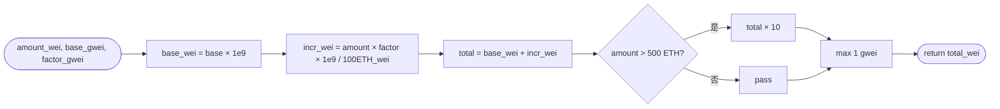
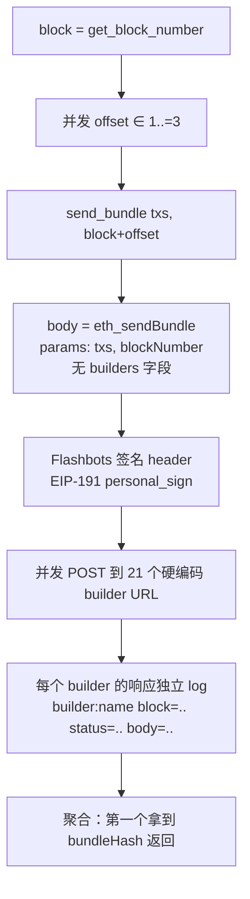

# aave_mev_mempool 执行流程

对应 `src/bin/aave_mev_mempool.rs`。用 mermaid 画，在支持 mermaid 的 Markdown viewer（VS Code、GitHub、Obsidian 等）里能直接渲染。

## 1. 整体主循环

启动 → 初始化依赖 → tokio::select 同时消费 pending tx 流和新 block 流。

## 2. max_withdraw_on_fork

在已 filter 通过的 fork 上做上边界二分，找出最大能 withdraw 的额度 + 对应 gas_used。

### try_withdraw 单次模拟

## 3. dispatch_bundles

统一的 bundle 分发流程。拿到 max amount 后，生成 4 个 plan（100% + 70/50/30%），每个单独签名并发 bundle。

### simulate_build_sign

一个 plan（label, amt）内部：模拟 → 算 gas → 构建 → 远程签名。

### compute_gas_price_wei

## 4. FlashbotsSender.send_txs

对 3 个 target block × 21 个 builder 两层 fan-out，并发 POST `eth_sendBundle`。

## 关键特性

| 特性 | 细节 |
|---|---|
| **nonce 共用** | 4 个 bundle 共享同一 `op_nonce`，链上至多 1 条 include，其余因 nonce 自动作废——这是"候选被夹走时抢剩余流动性"的机制 |
| **两路并行** | `tokio::select!` 多路复用 pending 流和 block 流；block 路径独立触发，不依赖 mempool 信号 |
| **filter 两层信号强度** | L1 selector 黑名单（ns 级）排明显噪音；L2 事件检测（百 ms 级 fork）精准过滤 |
| **gas 独立** | 每个 plan 单独跑 sim 取 gas_used ×1.3；gas_price 也按该 plan 的 amount 独立梯度缩放 |
| **Bundle fan-out 规模** | 1 次触发 = 4 plans × 3 blocks × 21 builders = **252** 次 HTTP POST |
| **Tx 类型** | EIP-1559 (type 0x2)，`max_fee = max_priority = gas_price_wei` |
| **资金路径** | Operator EOA → CoboSafe.execTransaction → Safe → WETHGateway.withdrawETH → Aave Pool |
